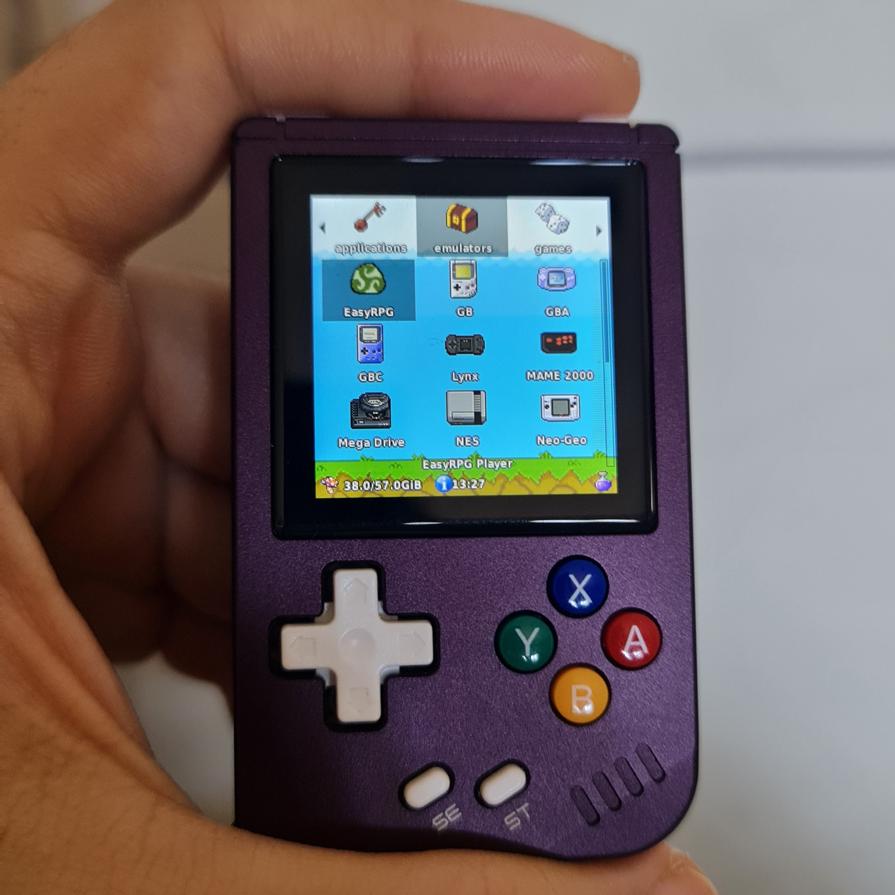
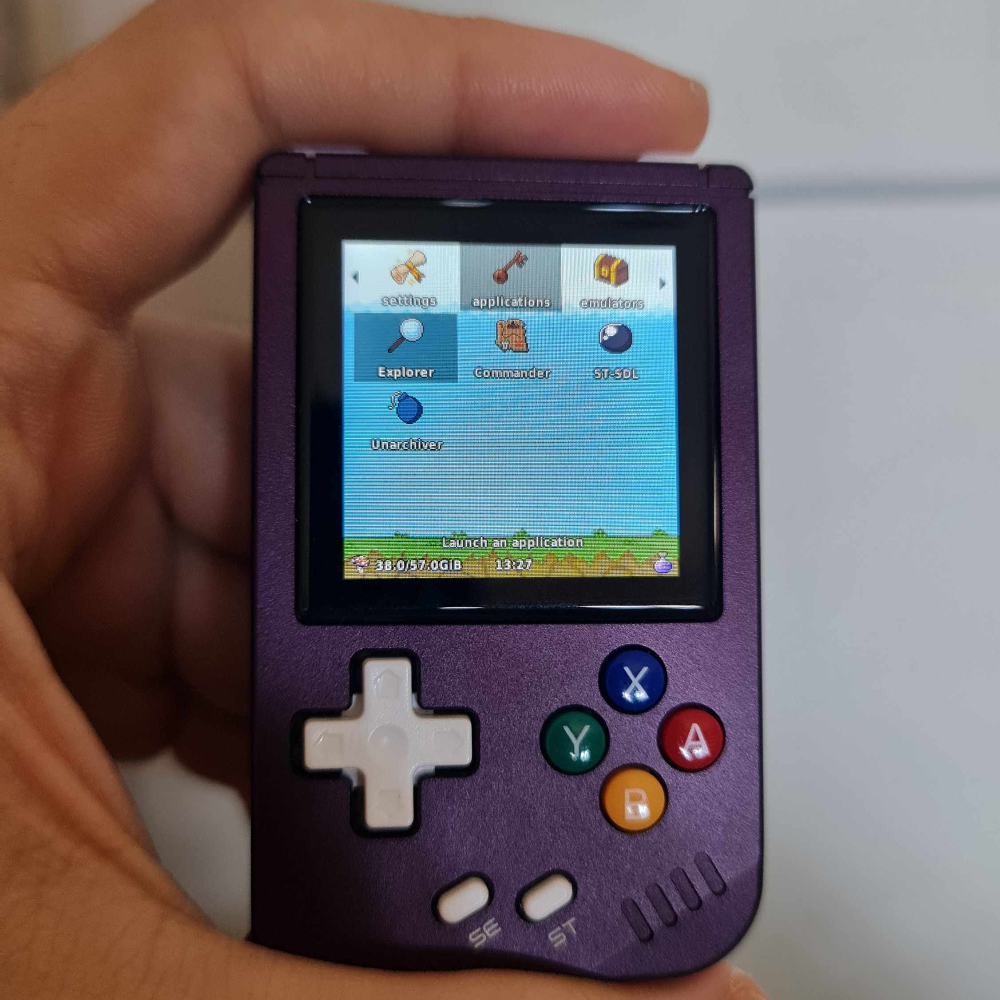
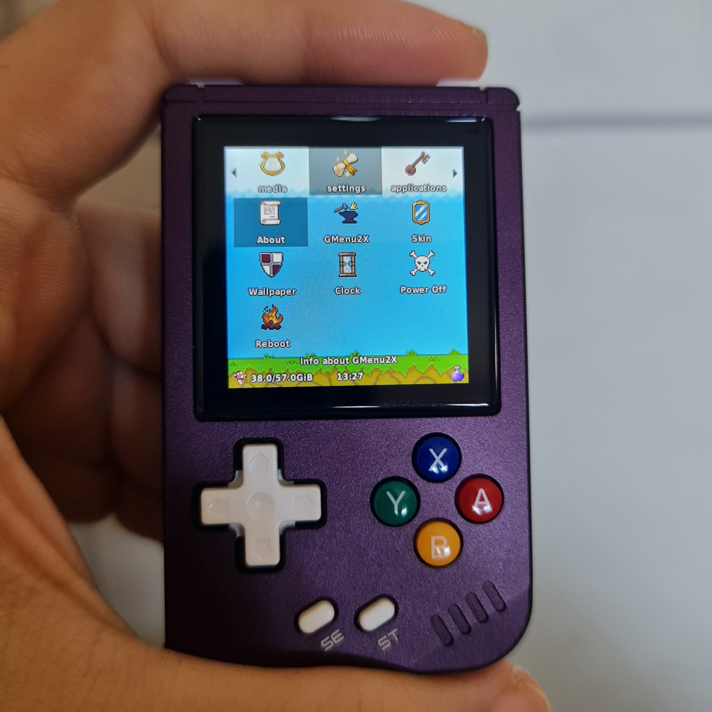

# Pixel-Fantasy  
**A gmenu2x theme for Funkey OS**  
*(Tested on the Anbernic RG Nano)*  

Pixel-Fantasy is a custom gmenu2x theme designed for the Funkey OS, specifically tailored for the compact Anbernic RG Nano. This theme brings a retro pixel-art aesthetic to your device, enhancing the menu navigation experience with a nostalgic and visually appealing interface.  

## Features  
- **Pixel-Art Aesthetic**: Inspired by classic retro gaming visuals.  
- **Optimized for RG Nano**: Designed with the RG Nano's small screen in mind for clear and easy navigation. It may also work on the Funkey System in other devices.  
- **Custom Icons**: Unique icons for menu categories and applications.  
- **Consistent Color Palette**: A cohesive theme to unify the user interface.

## Installation (Anbernic RG Nano)
1. Download the theme files from the repository.  
2. Connect your RG Nano to your computer via USB.  
3. Locate the `skins` folder in your Funkey OS installation.  
   - Typical path: `/mnt/FunKey/.gmenu2x/skins/240x240` (check your setup, if the .../skins/240x240 folder doesn't exist, just create it).  
4. Extract the contents of the `Pixel-Fantasy` zip file (you should get a Pixel-Fantasy folder) into the `240x240` directory.  
5. Disconnect the device and **restart** it.  
6. Open the settings in Funkey OS and select `Pixel-Fantasy` as your theme. Sometimes you may need to go into wallpaper in settings and select the one you would like to use (I am still tweaking the theme so it gets the wallpaper automatically, but sometimes it didn't work in my tests). 

## Compatibility  
- **Device**: Tested on Anbernic RG Nano.  
- **OS**: Funkey OS.  

## Screenshots  

## Contributions  
Contributions, feedback, and suggestions are welcome!  
If you’d like to improve the theme, fix bugs, or suggest features, feel free to submit an issue or create a pull request.  

## License  
This project is licensed under the [MIT License](LICENSE).  

## Credits  
- Theme design: [@jessikarochas](https://github.com/jessikarochas/) 
- Testing: Community members with the RG Nano  

---

Enjoy a fresh and immersive pixel-fantasy experience while navigating on your RG Nano!  
